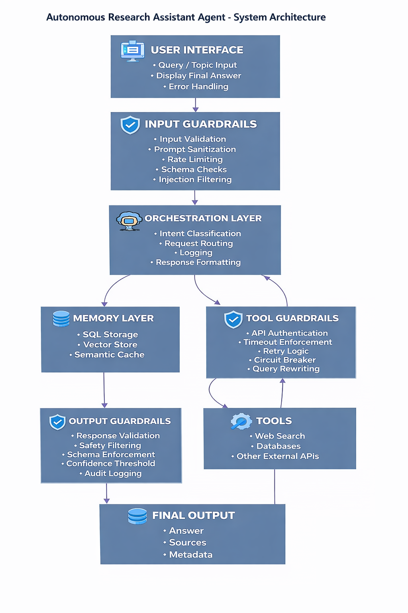

# Autonomous Research Assistant Agent

An autonomous, ReAct-based AI research assistant that performs structured reasoning, controlled tool usage, and semantic memory retrieval.

This project explores agentic AI beyond simple prompt-response systems by implementing planning, iterative reasoning, reflection, and layered guardrails.

---

## Architecture

  

The system follows a modular orchestration pattern:

- **Input Guardrails** – validation, sanitization, and request filtering  
- **Orchestration Layer (FastAPI)** – intent routing, logging, response formatting  
- **Agent Reasoning Core** – planner + research loop + reflection  
- **Tool Guardrails** – controlled external tool execution  
- **Memory Layer** – SQL storage + vector-based semantic retrieval  
- **Output Guardrails** – validation and safety checks before response release  

---

## Key Features

- ReAct-style planning and tool calling  
- Iterative research loop with reflection  
- Semantic memory using embeddings  
- Cosine similarity-based retrieval  
- Layered guardrails (input, tool, output)  
- Modular architecture for extensibility  

---

## Tech Stack

- **Frontend:** React  
- **Backend:** FastAPI (Python)  
- **LLM & Embeddings:** OpenAI API  
- **Search Tool:** Tavily  
- **Database:** PostgreSQL  
- **ORM:** SQLAlchemy  
- **Server:** Uvicorn  

---

## How It Works

1. User submits a research topic  
2. Input guardrails validate the request  
3. Agent plans next action  
4. If needed, tools (Tavily search) are invoked through tool guardrails  
5. Results are analyzed and refined via reflection  
6. Relevant context is stored and retrieved via semantic memory  
7. Output guardrails validate response before returning final answer  

---

## Running Locally

1. Clone the repository  
2. Create a virtual environment  
3. Install dependencies  
4. Run the FastAPI server
